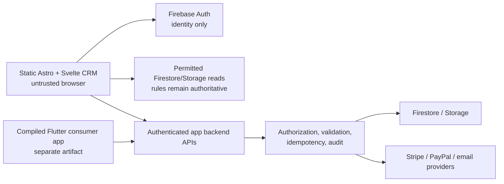

# HuddleWay Svelte CRM Release Boundary

Status: Active release contract

Decision owner: `bayard-rustin-architect`

Last reviewed: 2026-07-26

## Decision

The CRM administrator experience shipped from this repository is the Svelte
island mounted by Astro at `/admin/`. This repository owns the static browser
client only. It does not own the CRM database schema, Firebase authorization
rules, payment execution, privileged mutations, or the consumer Flutter app.

The authoritative CRM/backend project is:

`/Users/kennygrimblejr./HuddleWay`

The Svelte client must adapt to the contracts in that project. It must not
create a second schema or infer a contract from whichever legacy Firestore
documents happen to be present.

## Canonical source

The following paths are the only canonical source for the Svelte CRM release:

| Concern | Canonical path |
| --- | --- |
| Admin routes | `src/pages/admin/index.astro`, `src/pages/admin/setup.astro` |
| Browser layout | `src/layouts/CrmLayout.astro` |
| CRM UI | `src/components/crm/**/*.svelte` |
| Client authentication and state | `src/lib/authStore.ts` |
| Firebase/browser adapter | `src/lib/firebase.ts` |
| CRM client services | `src/lib/services/**/*.ts` |
| Authenticated API and public environment adapters | `src/lib/api/**/*.ts`, `src/lib/config/**/*.ts` |
| CRM styles | `src/styles/crm.css` |
| Static assets intentionally referenced by those sources | `public/`, subject to the artifact quarantine below |
| Build inputs | `astro.config.mjs`, `tailwind.config.mjs`, `tsconfig.json`, `package.json`, `package-lock.json` |

Test fixtures, test harnesses, one-off seed/query scripts, screenshots, local
emulator logs, and generated output are not production runtime source.

The source is not release-eligible merely because it exists in a local dirty
worktree. REL-005 must prove that each canonical path is tracked, comes from
the release commit, and is represented in a deterministic artifact manifest.

## Authoritative external contracts

The site consumes, but never supersedes, these app-project sources:

| Contract | Authoritative source in `/Users/kennygrimblejr./HuddleWay` |
| --- | --- |
| CRM collections, metadata, PII split, query rules | `docs/CRM_DATA_DICTIONARY.md` |
| Core invoice, transaction, refund, deposit, subscription schemas | `docs/FINANCIALS_SCHEMA_SOURCE_OF_TRUTH.md` |
| Universal metadata, tenant scoping, membership lifecycle, audit envelope | `backend/lib/crm_contracts.js` |
| Legacy registration, roster, and direct-invoice migration projections | `backend/lib/crm_migration_contract.js` |
| Direct-invoice money validation and lifecycle transitions | `backend/lib/direct_invoice_contract.js` |
| Stable roster-membership identity and batch normalization | `backend/lib/team_membership_contract.js` |
| Tenant/role authorization and backend-owned collections | `firestore.rules` |
| Tenant-scoped asset authorization | `storage.rules` |

Any disagreement between site code and those sources is a site defect. A
backend-contract change is made and reviewed in the app project first, then
consumed by this site in a separately reviewed adapter change.

### Reviewed snapshot versus release provenance

The app checkout was at Git commit
`fa098beebb0efd21d5c9d764e35860db169b2148` during this review, but that commit
does **not** identify the whole reviewed contract: the two contract docs and
four backend contract modules were untracked, and `firestore.rules` was
modified. The following SHA-256 values pin the exact files inspected for this
architecture decision:

| File | SHA-256 |
| --- | --- |
| `docs/CRM_DATA_DICTIONARY.md` | `0bb3057824f9e65e836eaa794f64fab39be720b42d5fc9b2cb2809d6e8fff1b1` |
| `docs/FINANCIALS_SCHEMA_SOURCE_OF_TRUTH.md` | `349363c509978b8f8faeac1d36fef1d956abddec22949430d2901b79dd43d0c0` |
| `backend/lib/crm_contracts.js` | `5f36d1510b4c63b24e32ac83ed6a5f74b0f66df2c07cb944e2fa48179d5f48c0` |
| `backend/lib/crm_migration_contract.js` | `7c6a1f3048aa2e27e06309fa7a1037e8bb01880c9e41054964055a9d93749ed5` |
| `backend/lib/direct_invoice_contract.js` | `62591faa2f80b82ed7e83889ab3c93b946f2966bcf1ee1ad91e9a5e7a6ca542f` |
| `backend/lib/team_membership_contract.js` | `8afb8f4a547eee0309618d680498ace25c6b02aa90b89267640dc2a655d4feab` |
| `firestore.rules` | `db9d345729360cd33f6decd36fe634b122a3f513a57cef8361cf9b97b26b59e9` |
| `storage.rules` | `8b1ff9e11a7cf82b7f5928db3ebf16b80c734b59832a37b9164aeaf559f67fed` |

These hashes are review evidence, not permission to deploy an uncommitted
backend contract. REL-005 must pin the site artifact to a tracked, reviewed
app-contract revision (or a versioned contract artifact) before production.

## Runtime and trust boundaries



The boundaries are:

1. The browser is untrusted. UI visibility and disabled controls are usability
   features, not authorization.
2. Firebase Auth establishes identity. Tenant access is resolved by backend
   contracts and production rules; a client-selected `tenantId` is never proof
   of access.
3. Direct client access is limited to the reads and low-risk writes explicitly
   allowed by the app project's Firebase rules.
4. Financial writes, invoice issue/void/refund operations, roster batch
   changes, invitations, imports, exports, audit writes, provider operations,
   and reconciliation go through authenticated backend operations.
5. The app backend owns validation, tenant and role checks, idempotency,
   optimistic concurrency, provider reconciliation, and audit evidence.
6. The Flutter consumer application is a separate product/runtime artifact.
   The Svelte CRM may link to or preview an attested consumer release, but does
   not build or own it.

## Canonical routes and artifact

The canonical browser entry points are:

- `/admin/` for authenticated CRM operation.
- `/admin/setup/` for tenant onboarding/setup.

The deployable site artifact is a fresh, generated `dist/` directory produced
from a clean release checkout. `dist/` is never source and must never be
hand-edited or copied forward from an earlier release.

The minimum release command chain is:

```text
npm ci
npm run check
npm test
npm run build
```

REL-005 owns the exact CI implementation. It is implemented by
`scripts/release/crm-release.mjs`, the `release:*` package commands, and
`.github/workflows/crm-release-gate.yml`. Its candidate manifest records at
least:

- source commit SHA and whether the checkout was clean;
- `package-lock.json` checksum and Node/npm versions;
- exact validation and build commands;
- checksums for the final deployable files;
- the `/admin/` and `/admin/setup/` route inventory;
- the separately attested identity of any consumer-app artifact;
- the environment/configuration identifier without recording secrets.

The release environment must provide a release-environment identifier, a
non-loopback HTTPS backend URL, a non-development Firebase project, disabled
emulators, and enabled Firebase App Check with the real reCAPTCHA Enterprise
site key supplied through CI secrets. The key must match the separately
configured approved SHA-256. The gate rejects missing, mismatched, fake, test,
example, and placeholder App Check keys. It records only the approved hash as
a non-secret configuration identity, not the value itself.

The backend contract must be checked out cleanly at the full commit named by
`HUDDLEWAY_BACKEND_CONTRACT_REF`. If the generated Svelte CRM refers to `/app`,
the release also requires a complete consumer-app attestation: release ID,
artifact SHA-256, owner, and previous accepted rollback release ID. That
attests a separately deployed consumer application; it never turns
`public/app/**` into canonical Svelte source.

The backend contract inventory includes the transitive source used by its own
qualification tests: backend configuration and modules, Firestore and Storage
rules, deployed Functions helpers, and `lib/src/**/*.dart`. This prevents a
dirty app worktree from supplying newer mobile, onboarding, payment, App
Check, or media behavior than the pinned backend commit. A clean candidate
must also carry canonical source deletions, including retired activation
billing files, rather than silently restoring them from the parent revision.

### Review-only candidate scoping

Run `npm run release:scope` before preparing either commit. The command is
read-only: it does not stage, commit, reset, copy, delete, or write a receipt.
It inventories the same canonical site and backend-contract paths used by
preflight, hashes every file, reports tracked versus untracked canonical
inputs, and separates canonical status entries from unrelated worktree
entries. The JSON explicitly reports `reviewOnly: true`, `mutatesGit: false`,
and `cleanCandidate: false` until the complete checkout—not only the canonical
subset—is clean and every canonical input is tracked.

The site side covers every Astro/Svelte/TypeScript/CSS source file, release
configuration and test, and every public asset except the explicitly
quarantined `public/app/**` consumer artifact. This keeps marketing claims,
free-onboarding language, performance budgets, and copied public bytes bound
to the same site revision as the CRM.

Use an alternate authoritative backend checkout with:

```sh
npm run release:scope -- \
  --backend-root /absolute/path/to/HuddleWay
```

The output is a review aid, not a commit recipe or deployment receipt. A
repository owner must still review file contents, create deliberately scoped
commits, and rerun `release:preflight` from clean checkouts. Never use a broad
`git add -A` merely because the scope report identified canonical files.

Candidate provenance is necessary but not sufficient for production.
`scripts/release/crm-external-evidence.mjs`,
`scripts/release/crm-media-evidence.mjs`, and
`.github/workflows/crm-media-evidence.yml` provide commit-bound fixture-media
collection without retaining its private URL tokens.
`.github/workflows/crm-production-acceptance.yml` separately requires a
protected, privately stored evidence document whose approved SHA-256 binds:

- a fresh encrypted schema-v3 Firestore and Storage restore/readback/rollback
  receipt with explicit owner/operator approval;
- provider saved queries, routed alert receipts, and support correlation
  lookup;
- supported web, Android, and iOS App Check telemetry;
- authenticated field Core Web Vitals, edge latency, CDN compression/cache,
  and fixture-media derivative evidence;
- an explicit single-developer governance record requiring automated
  validation and separate final production confirmation;
- a single-owner, time-bounded deployment approval and accepted rollback
  artifact.

The validator binds those gates to the exact website commit, backend commit,
environment, and built artifact checksum. It rejects additional JSON fields,
stale receipts, production recovery targets, missing consumer classes,
out-of-budget metrics, owner mismatches, expired windows, and any mismatch
between the private file and its separately approved SHA-256. CI deletes the
private document and publishes only the redacted, checksum-protected
`.release/crm-production-acceptance.json`. Protected CI packages the verified
artifact and receipts into one deterministic archive and uses GitHub's
Sigstore-backed artifact attestation to sign its provenance. Deployment must
verify both the archive SHA-256 and that provider signature.

The production static-host target is `porkbun-huddleway-static`. Publishing is
allowed only after REL-007 accepts every required gate and the protected
acceptance workflow produces a receipt for that exact artifact. Rollback means
redeploying the immediately preceding accepted, checksummed artifact; it does
not mean rebuilding an old branch with current dependencies.

`.github/workflows/crm-production-deploy.yml` and
`scripts/release/crm-production-deploy.mjs` implement that boundary. They
download the accepted archive from its named protected run, verify its
independently supplied SHA-256 and exact GitHub signer/source attestation,
bind the current branch tree to the accepted rollback commit and artifact
digest, stage without rebuilding, and allow only a normal fast-forward commit.
Live acceptance requires exact public artifact bytes, both CRM routes, Brotli
and gzip, one-year immutable caching, warm CDN hits, and healthy correlated
backend response. A failed post-deploy check automatically creates a normal
revert commit after proving that it restores the accepted rollback tree. See
`docs/CRM_PRODUCTION_DEPLOYMENT.md`.

## Artifact quarantine

Quarantine means “excluded from release authority and rejected unless
explicitly attested”; it does not authorize deleting another team's files.

| Path or artifact | Classification | Release rule |
| --- | --- | --- |
| `dist/**` | Generated local output | Delete/rebuild in CI; never use as source or provenance. |
| `public/app/admin/**` | Stale duplicate Astro admin build | Always reject from the Svelte CRM artifact. |
| `public/app/_astro/CrmApp.*` and `public/app/_astro/SetupWorkflow.*` | Stale compiled CRM bundles | Always reject. Hash/name variations are also rejected. |
| Other duplicated marketing routes under `public/app/**` | Nested site copy, not CRM source | Reject unless the consumer artifact owner proves they are required. |
| `public/app/main.dart.js`, CanvasKit, Flutter assets | Compiled consumer app without source/maps in this repository | Separate product artifact. Block inclusion until REL-005 pins its producing repository, commit/version, checksum, owner, and rollback artifact. |
| `public/app/index_crm.html` or template/demo shells | Legacy/template output | Reject. |
| `.tmp/**`, `*-deploy/**`, screenshots, logs | Local review/deploy residue | Reject. |
| Root and `scripts/` ad-hoc query, seed, screenshot, and production-fix scripts | Operator utilities with unproven scope | Reject from static output; never run as part of a browser build. |
| `src/lib/testFixtures.ts`, `tests/**`, Playwright/Vitest output | Test-only | May run in CI but must not be imported by production bundles. |

The automated artifact gate deletes `dist/app/**` from the candidate and then
rejects any surviving nested app, legacy `index_crm.html`, quarantined CRM
route reference, broken local asset reference, or artifact inventory/checksum
drift. A `/app` reference in a canonical bundle requires the separate consumer
attestation above. The current `public/app/**` payload and local `dist/**`
remain unacceptable production evidence because they were not produced from
clean committed inputs. BLK-002 is resolved as an ownership decision—the
Flutter app is separate—but its release identity remains an enforced
provenance input.

## CI release evidence and current state

The successful command sequence is encoded in the release manifest and
enforced by `npm run release:ci`. CI pins Node `24.3.0`, npm `11.5.2`, the
package lock, the website commit/tree, and the clean app-backend contract
commit/tree. It retains the checksummed `dist/` plus manifest for 30 days and
keeps failure diagnostics for seven days.

On 2026-07-26, the canonical source passed type checking with zero errors, 25
unit tests, two component tests, one non-emulator integration test, a clean
Astro build, stale-app quarantine, and static security validation. Fixture
checks proved that quarantine removes `dist/app/**` and rejects a surviving
legacy shell.

The live release preflight intentionally remains red: the website source and
the reviewed app-backend contract are not clean committed checkouts. The
production dependency audit also reports high-severity findings. No manifest
was issued and no deployment was attempted; passing build output alone is not
release provenance.

## Environment contract

Production configuration must be supplied by the release environment and
validated before build. No production release may depend on:

- hard-coded development Firebase identifiers;
- a default tenant or fabricated tenant/user identity;
- localhost or emulator fallbacks;
- demo mode, simulated processor success, or fake financial data;
- secrets embedded in the static JavaScript bundle;
- a backend endpoint whose environment and contract version are unknown.

The browser may contain public Firebase web configuration, but not service
credentials, payment secrets, OAuth secrets, invite tokens, or privileged API
keys. App Check and backend endpoint configuration are security gates owned by
SEC-005.

## Data-release boundary

The browser must use the app project's schema version 1 contract and its
tenant-private split. In particular:

- operational records carry `tenantId`, `schemaVersion`, `source`, server-owned
  timestamps, and actor metadata as defined by `crm_contracts.js`;
- private registration, person, guardian, medical, waiver, address, and billing
  detail remains under `tenant_private/{tenantId}/...`;
- tenant queries begin with `tenantId == activeTenantId`;
- clients never write processor ledger collections;
- display labels, emails, and names are not stable identifiers;
- client adapters reject unknown or malformed state instead of fabricating
  placeholder values.

The detailed alignment and state ownership rules are in
`docs/CRM_BACKEND_CONTRACT_ALIGNMENT.md`.

## Release-boundary acceptance criteria

REL-001 is architecturally complete when this decision is recorded. The
overall release remains blocked until implementation and audit prove all of
the following:

- canonical source is tracked and clean-buildable;
- stale admin bundles are absent from the artifact;
- any consumer app is separately attested;
- the Svelte services use the authoritative backend/API contracts;
- no forbidden direct write is present;
- CI emits and verifies the artifact manifest;
- protected CI emits and verifies a redacted external-evidence acceptance
  receipt bound to the exact artifact;
- REL-007 approves the evidence before deployment.
